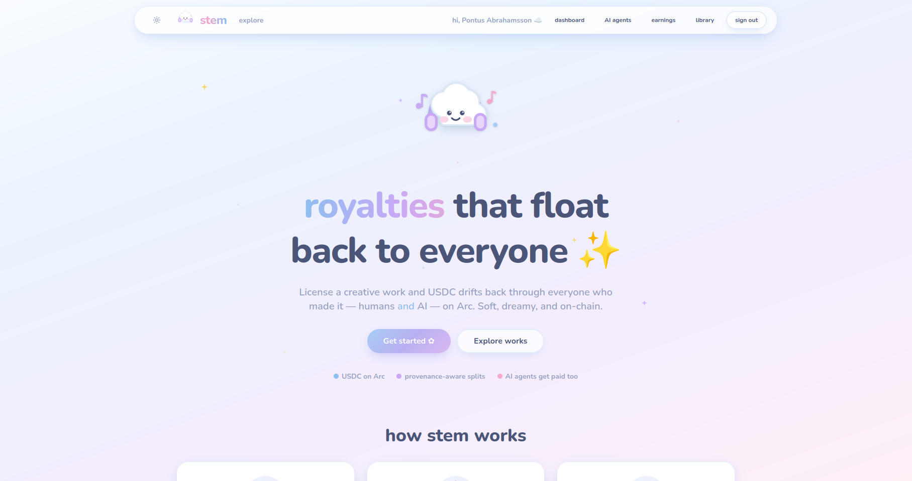

# stem — Provenance-Aware Royalty Protocol

Register a creative work, declare who made it — **humans *and* AI** — and when the
work is licensed via on-chain escrow, the released USDC **fans out to every
contributor by their split**. AI contributors get their own Circle wallet **and**
an ERC-8004 on-chain identity, and earn USDC like anyone else.

Built on Arc Testnet with Next.js, Supabase, and Circle Developer-Controlled
Wallets. Escrow runs on the deployed **ERC-8183 AgenticCommerce** job contract;
royalty fan-out uses Circle wallet-to-wallet USDC transfers. Work deliverables
are validated by **Claude** before funds are released.

> **Provenance:** This project is built on top of Circle's
> [Workflow Escrow Refund Protocol](https://github.com/akelani-circle/workflow-escrow-refund-protocol)
> sample (the Next.js + Supabase + Circle DCW boilerplate). The royalty layer —
> contributor splits, AI contributors with Circle wallets + ERC-8004 identities,
> royalty fan-out, the provenance chain, and Claude-based validation — is the work
> added in this repo.



## Table of Contents

- [How It Works](#how-it-works)
- [Architecture](#architecture)
- [Prerequisites](#prerequisites)
- [Getting Started](#getting-started)
- [Environment Variables](#environment-variables)
- [Demo Script](#demo-script)
- [Security & Usage Model](#security--usage-model)

## How It Works

- A creator **registers a work** and attaches contributors with royalty
  `split_pct` (validated to sum to 100%) — contributors can be humans or AI.
- When an **AI contributor** is added, the app provisions it a
  [Circle Developer-Controlled Wallet](https://developers.circle.com/wallets/dev-controlled)
  **and** registers an **ERC-8004 on-chain identity**, so the AI is a first-class,
  payable participant.
- A buyer **licenses** a work, which creates and budgets one
  **ERC-8183 AgenticCommerce** escrow job on **Arc Testnet** (USDC is the native
  gas token). The agent wallet is the on-chain `provider` + `evaluator`.
- On release, **Claude** validates the delivered work against the agreement
  criteria; on success the agent `complete`s the job and the escrowed USDC
  **fans out** to each contributor by their split via Circle transfers.
- **Webhook signature verification** marks each royalty transfer COMPLETE and
  closes the license once all settle.
- **Real-time UI updates** are powered by Supabase Realtime subscriptions — payout
  statuses flip live as transfers settle.
- Registering a **derivative work** links back to its source, building an on-chain
  **provenance chain**.

## Architecture

| Layer | What it does |
| --- | --- |
| `works`, `contributors` | A work and its human/AI contributors with royalty `split_pct` (sum = 100%). AI contributor wallets live in `wallets` with `profile_id = NULL`. |
| `licenses` | One ERC-8183 escrow job per license. The agent wallet is on-chain `provider` + `evaluator`. |
| `royalty_payments` | One row per contributor per release; tracks each Circle transfer to COMPLETE. |

### Arc Testnet contracts (see `lib/utils/arc.ts`)

```
USDC                 0x3600000000000000000000000000000000000000
ERC-8183 commerce    0x0747EEf0706327138c69792bF28Cd525089e4583
ERC-8004 identity    0x8004A818BFB912233c491871b3d84c89A494BD9e
```

### License lifecycle

```
INITIATED → JOB_CREATED → BUDGETED → APPROVED → FUNDED
          → SUBMITTED → COMPLETED → SPLITTING → CLOSED
```

## Prerequisites

- **Node.js v22+** — Install via [nvm](https://github.com/nvm-sh/nvm)
- **Supabase CLI** — Install via `npm install -g supabase` or see [Supabase CLI docs](https://supabase.com/docs/guides/cli/getting-started)
- **Docker Desktop** (only if using the local Supabase path) — [Install Docker Desktop](https://www.docker.com/products/docker-desktop/)
- **[ngrok](https://ngrok.com/)** — For local webhook testing
- Circle Developer Controlled Wallets **[API key](https://console.circle.com/apikeys)** and **[Entity Secret](https://developers.circle.com/wallets/dev-controlled/register-entity-secret)**
- **[Anthropic API key](https://console.anthropic.com/settings/keys)** — Claude validates delivered work before royalties are released
- Arc Testnet USDC from the **[Circle Faucet](https://faucet.circle.com)** — funds the agent wallet (on Arc, gas is paid in USDC)

## Getting Started

1. Clone the repository and install dependencies:

   ```bash
   git clone git@github.com:pontusva/stem.git
   cd stem
   npm install
   ```

2. Set up environment variables:

   ```bash
   cp .env.example .env.local
   ```

   Then edit `.env.local` and fill in all required values (see [Environment Variables](#environment-variables)). Leave `NEXT_PUBLIC_AGENT_WALLET_ID`, `NEXT_PUBLIC_AGENT_WALLET_ADDRESS`, and `CIRCLE_BLOCKCHAIN` blank — they are auto-generated in step 4.

3. Set up the database — choose one path:

   <details>
   <summary><strong>Path 1: Local Supabase (Docker)</strong></summary>

   Requires Docker Desktop installed and running.

   ```bash
   npx supabase start
   npx supabase migration up
   ```

   The output of `npx supabase start` displays the Supabase URL and API keys (including the **service role key**) needed for your `.env.local`.

   </details>

   <details>
   <summary><strong>Path 2: Remote Supabase (Cloud)</strong></summary>

   Requires a [Supabase](https://supabase.com/) account and project.

   ```bash
   npx supabase link --project-ref <your-project-ref>
   npx supabase db push
   ```

   Retrieve your project URL and API keys from the Supabase dashboard under **Settings → API**.

   </details>

4. Generate the agent wallet:

   ```bash
   npm run generate-wallet
   ```

   This creates the Circle developer-controlled **agent wallet** and writes the wallet ID, address, and blockchain values into your `.env.local`.

5. **Fund the agent wallet** with Arc Testnet USDC from <https://faucet.circle.com>. On Arc, gas is paid in USDC, and the agent wallet pays gas for `setBudget`, `submit`, `complete`, ERC-8004 `register`, and every royalty transfer.

6. Start the development server:

   ```bash
   npm run dev
   ```

   The app will be available at `http://localhost:3000`.

7. Set up Circle Webhooks (for local development):

   In a separate terminal, expose your local server:

   ```bash
   ngrok http 3000
   ```

   Then in the [Circle Console → Webhooks](https://console.circle.com/webhooks), add an endpoint: `https://your-ngrok-url.ngrok.io/api/webhooks/circle`. Keep ngrok running to receive webhook events.

## Environment Variables

Copy `.env.example` to `.env.local` and fill in the required values:

| Variable | Scope | Purpose |
| --- | --- | --- |
| `VERCEL_URL` / `NEXT_PUBLIC_VERCEL_URL` | Server / Public | Base URL of the deployment (e.g. `http://localhost:3000`). |
| `NEXT_PUBLIC_SUPABASE_URL` | Public | Supabase project URL. |
| `NEXT_PUBLIC_SUPABASE_ANON_KEY` | Public | Supabase anonymous/public key. |
| `SUPABASE_SERVICE_ROLE_KEY` | Server-side | Privileged server-side writes + file storage. |
| `NEXT_PUBLIC_USDC_CONTRACT_ADDRESS` | Public | USDC token contract address (Arc Testnet: `0x3600…0000`). |
| `NEXT_PUBLIC_AGENT_WALLET_ID` | Public | Circle wallet ID for the escrow agent. Auto-generated. |
| `NEXT_PUBLIC_AGENT_WALLET_ADDRESS` | Public | Wallet address for the escrow agent. Auto-generated. |
| `CIRCLE_API_KEY` | Server-side | Circle API key for wallet and contract operations. |
| `CIRCLE_ENTITY_SECRET` | Server-side | Circle entity secret for signing transactions. |
| `CIRCLE_BLOCKCHAIN` | Server-side | Blockchain network identifier (e.g. `ARC-TESTNET`). Auto-generated. |
| `ANTHROPIC_API_KEY` | Server-side | Claude — validates delivered work before release. |
| `OPENAI_API_KEY` | Server-side | Optional / legacy (validation now uses Claude). |
| `GOOGLE_CLIENT_ID` / `GOOGLE_CLIENT_SECRET` | Server-side | Google sign-in (optional). |

## Demo Script

1. **Register a work** with two contributors — yourself + an **AI contributor**
   (e.g. "Claude Composer") at, say, 70/30. On submit, the AI gets a Circle wallet
   and an ERC-8004 identity (linked on Arcscan from the work page).
2. From a second account, open the work and **License this work** — this creates
   and budgets the ERC-8183 job on Arc.
3. **Fund escrow** (buyer), then **Validate work & release royalties**. The agent
   receives the escrow, then USDC fans out: 70% to you, 30% to the AI wallet —
   watch the payout statuses flip to COMPLETE live.
4. **Register a derivative** linking to the original to show the provenance chain.

## Security & Usage Model

This sample application:
- Assumes **testnet usage only**
- Handles secrets via environment variables
- Verifies webhook signatures
- Is **not** intended for production use without modification

See also [`ROYALTY_PROTOCOL.md`](ROYALTY_PROTOCOL.md) for the full protocol design,
[`KNOWN_LIMITATIONS.md`](KNOWN_LIMITATIONS.md), and [`SECURITY.md`](SECURITY.md).
